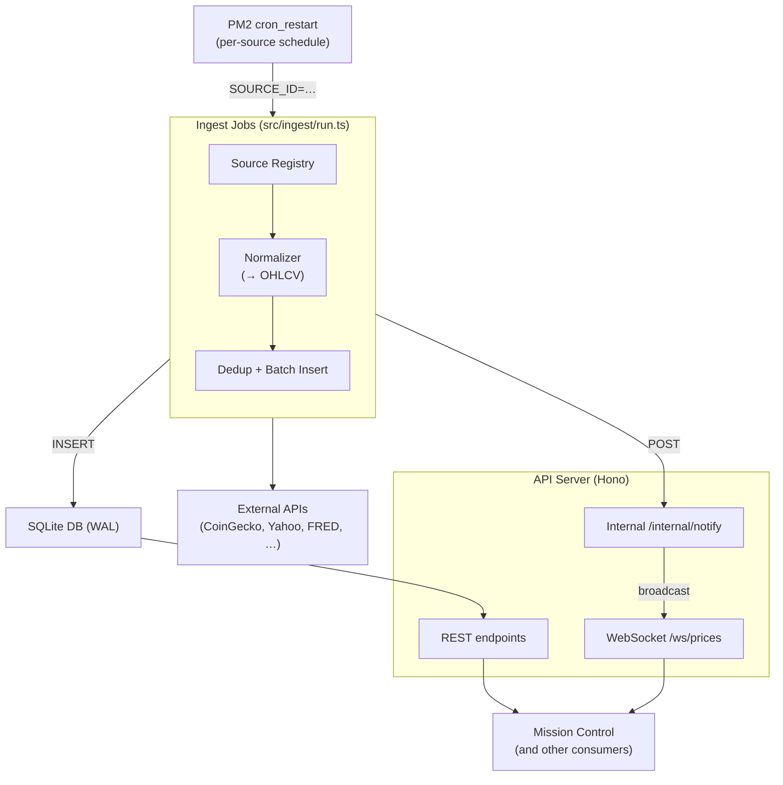

# Pulsar

Pulsar is the financial data ingest and storage service for the **salsquared** ecosystem. It fetches market data from external APIs on a schedule, normalizes everything into a common OHLCV schema, persists it locally, and exposes it through a clean REST + WebSocket API. Mission Control and other internal consumers query Pulsar instead of calling CoinGecko, Yahoo Finance, FRED, etc. directly.

It runs as a Node backend (no UI) behind Cloudflare Tunnel:

| API port | DB path | DB port (reserved) |
|:---|:---|:---|
| `3103` | `prisma/pulsar.db` | `8103` |

The DB port is reserved for a future PostgreSQL/TimescaleDB migration; today the database is SQLite (WAL mode).

---

## How it fits together



Scheduling is owned entirely by PM2's `cron_restart` — there is no in-process scheduler. Each ingest source is a short-lived PM2 entry that runs `src/ingest/run.ts`, fetches once, inserts, notifies the API, and exits. Full architectural rationale in [`docs/architecture.md`](docs/architecture.md).

---

## Tech stack

| Concern | Choice |
|:---|:---|
| Runtime | Node.js LTS (24.x) |
| Language | TypeScript |
| HTTP / WS | Hono (`@hono/node-ws` for WebSocket) |
| ORM | Prisma |
| Database | SQLite (WAL mode) |
| Process manager / scheduler | PM2 (`cron_restart` for ingest jobs) |
| Package manager | npm |

---

## Quick start

### Prerequisites

- Node.js 24.x
- npm
- PM2 (`npm i -g pm2`) — only needed for production / cron-driven ingest

### Install and run

```bash
cp .env.example .env            # fill in API keys + PULSAR_INTERNAL_TOKEN
npm install
npx prisma migrate dev          # creates prisma/pulsar.db
npm run dev                     # http://localhost:3103 (or `npm run build && npm run start` for the built version)
```

`npm run dev` runs the entry via `tsx` (no build step). To run any source ingest manually:

```bash
SOURCE_ID=coingecko npx tsx src/ingest/run.ts
```

### Production

```bash
npm run build
npx prisma migrate deploy
pm2 start ecosystem.config.cjs --only "pulsar*"
```

`ecosystem.config.cjs` lives at the salsquared workspace root and contains entries for the API server, every per-source ingest job, and the nightly rollup. See [PM2 process inventory](#pm2-process-inventory).

---

## API

Base URL: `http://localhost:3103/api`.

### REST endpoints

| Method | Path | Description |
|:---|:---|:---|
| `GET` | `/assets` | List all active assets with metadata |
| `GET` | `/assets/:id` | Single asset detail |
| `GET` | `/prices/latest` | Latest tick for all active assets (filterable by `?class=crypto`) |
| `GET` | `/prices/:id` | Latest tick for a single asset |
| `GET` | `/history/:id` | OHLCV history — params: `from`, `to`, `interval` (`1h`, `1d`, `1w`) |
| `GET` | `/history/:id/summary` | Pre-aggregated daily summary rows |
| `GET` | `/macro` | All latest macro series values |
| `GET` | `/macro/:seriesId` | History for a single macro series |
| `GET` | `/status` | Ingest job status, last run times, DB row counts |
| `GET` | `/status/jobs` | Recent `IngestJob` log entries |
| `GET` | `/health` | Liveness check (DB ping). Not cached |
| `POST` | `/ingest/:sourceId` | Manually trigger a single source ingest. Internal — requires `PULSAR_INTERNAL_TOKEN` |

Public reads are wrapped in an in-memory TTL cache (`X-Cache: HIT | MISS | STALE-FALLBACK`). Cache key = `pathname + sorted query params`.

### WebSocket

`GET /ws/prices` upgrades to a WebSocket. Subscribe to assets:

```json
{ "type": "subscribe", "assetIds": ["bitcoin", "AAPL", "EUR/USD"] }
```

The server pushes `tick` messages whenever a subscribed asset has a new `PriceTick` inserted. Delivery is best-effort (not durable) — clients should sync state via REST on reconnect. Full protocol in [`docs/architecture.md#websocket-push-real-time-updates`](docs/architecture.md#websocket-push-real-time-updates).

---

## Data sources

| Source | Coverage | Schedule (`cron_restart`) |
|:---|:---|:---|
| CoinGecko | Top-100 crypto market data + per-coin history | `*/5 * * * *` |
| Mempool.space | Bitcoin network fees | `*/2 * * * *` |
| Yahoo Finance | OHLCV for stocks, ETFs, commodity proxies | `*/15 * * * *` |
| ExchangeRate-API | Major forex pairs | `0 * * * *` |
| FRED | CPI, GDP, Fed Funds, unemployment, etc. | `0 6 * * *` |

Adding a new source = a `SourceConfig` entry in `src/lib/source-registry.ts` plus a matching PM2 entry in `ecosystem.config.cjs`.

---

## Configuration

`.env` is not committed. Copy the example template and fill in values:

```bash
cp .env.example .env
```

| Var | Source | Purpose |
|:---|:---|:---|
| `DATABASE_URL` | `.env` | SQLite file path — `file:./pulsar.db` (relative to `prisma/`) |
| `COINGECKO_API_KEY` | `.env` | CoinGecko API key |
| `ALPHA_VANTAGE_KEY` | `.env` | Alpha Vantage API key |
| `FRED_API_KEY` | `.env` | FRED API key |
| `EXCHANGERATE_API_KEY` | `.env` | ExchangeRate-API key |
| `PULSAR_INTERNAL_TOKEN` | `.env` | Shared secret for `/internal/*` and `POST /ingest/:sourceId` |
| `TICK_RETENTION_DAYS` | `.env` (optional) | `PriceTick` retention window (default `90`) |
| `PORT` | `.env` or PM2 entry | API server port (default `3103`) |
| `STARTUP_DELAY_SECONDS` | per-PM2 entry (optional) | Stagger ingest job startup to avoid boot bursts |
| `SOURCE_ID` | per-PM2 entry | Which source the ingest run.ts should fetch |
| `NODE_ENV` | per-PM2 entry | `production` |

---

## Project layout

```
pulsar/
├── src/
│   ├── index.ts              # Hono entry point; mounts routes + WS
│   ├── routes/               # REST + WS + internal handlers
│   ├── ingest/
│   │   ├── run.ts            # PM2 entry: SOURCE_ID env → runIngest → exit
│   │   ├── pipeline.ts       # fetch → normalize → dedup → insert; backfill()
│   │   ├── rollup.ts         # nightly DailySummary aggregation + tick pruning
│   │   └── sources/          # one fetcher per source
│   ├── lib/                  # cache, prisma, logger, source-registry, auth, notify
│   └── types.ts
├── prisma/
│   └── schema.prisma
├── scripts/                  # one-off scripts run via `npx tsx`
├── docs/
│   └── architecture.md       # full design rationale
├── CLAUDE.md                 # repo guidance for Claude Code
└── README.md
```

---

## Development

| Command | Effect |
|:---|:---|
| `npm run dev` | Server on port 3103 via `tsx` (no build) |
| `npm run dev:watch` | Same as `dev` with `--watch` (standalone, not under PM2) |
| `npm run start` | Built server on port 3103 (`dist/index.js`) |
| `npm run build` | Compile TypeScript to `dist/` |
| `npm run lint` | ESLint + `tsc --noEmit` |
| `npx prisma migrate dev` | Apply schema changes in dev |
| `npx prisma generate` | Regenerate Prisma client |
| `npx tsx src/index.ts` | Run entry directly without building |

One-off scripts (fetcher experiments, DB inspection, manual backfills) belong in `scripts/` as kebab-case `.ts` files, invoked via `npx tsx`. Do not commit experiments to the repo root.

---

## Operations

### PM2 process inventory

| Name | Role | Schedule |
|:---|:---|:---|
| `pulsar` | API server (3103) | always-on |
| `pulsar-ingest-coingecko` | CoinGecko fetch | `*/5 * * * *` |
| `pulsar-ingest-mempool` | Mempool fees | `*/2 * * * *` |
| `pulsar-ingest-yahoo` | Yahoo Finance | `*/15 * * * *` |
| `pulsar-ingest-exchangerate` | ExchangeRate-API | `0 * * * *` |
| `pulsar-ingest-fred` | FRED macro | `0 6 * * *` |
| `pulsar-rollup` | Nightly rollup + tick prune | `30 0 * * *` |

All ingest and rollup entries use `autorestart: false` — PM2 only fires them at their cron time.

### Useful PM2 commands

```bash
pm2 logs "pulsar*"                # tail every Pulsar process
pm2 logs pulsar-ingest-coingecko  # one ingest job
pm2 reload "pulsar*"              # graceful reload after a deploy
pm2 status                        # snapshot of all processes
```

### Deploy flow

1. `git pull`
2. `npm ci`
3. `npm run build`
4. `npx prisma migrate deploy` (never run by PM2 — schema migrations are a deploy-time step)
5. `pm2 reload "pulsar*"`

### Constraints worth knowing

- **SQLite WAL mode is mandatory.** Multiple PM2 processes (API + every ingest job + rollup) write to the same SQLite file. `src/lib/prisma.ts` runs `PRAGMA journal_mode=WAL`, `busy_timeout=5000`, `synchronous=NORMAL` on every client init.
- **Scheduled ingests are incremental-only.** `cron_restart` will SIGKILL a still-running process at the next cron tick — long backfills go through `/history/:id` (which calls `pipeline.backfill()` inline in the API process) or a one-off `scripts/` invocation, never inside an ingest entry.
- **WebSocket delivery is best-effort.** If the API process is down when a job inserts ticks, the rows are still in the DB and a reconnecting client recovers via REST.
- **All timestamps are UTC.** Source fetchers convert any market-local times before producing `NormalizedTick`.

---

## Documentation

- [`docs/architecture.md`](docs/architecture.md) — full design rationale: ingest pipeline, schema, source registry, WebSocket protocol, auth plan, downsampling worker, and operational constraints.
- [`CLAUDE.md`](CLAUDE.md) — day-to-day operational guidance for working in the repo (also consumed by Claude Code).
