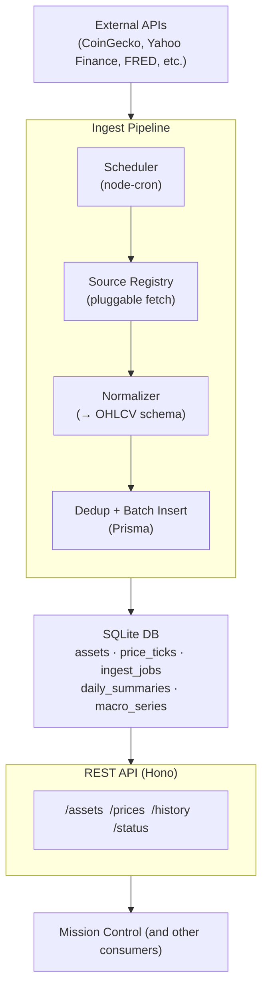

# Pulsar — Architecture Plan

## Overview

Pulsar is a dedicated financial data ingest and storage service within the `salsquared` ecosystem. It runs as a standalone backend (not a Next.js app) at **port 3103** (prod) / **4103** (dev), with its database reserved at **8103** (prod) / **8203** (dev).

Its job is to own all financial data: fetch it on a schedule from external APIs, normalize it into a consistent local schema, persist it, and expose it via a clean REST API. Mission Control and other internal consumers replace their direct external API calls with calls to Pulsar.

This separates concerns clearly:
- **Pulsar** — knows about data sources, ingestion timing, schema, and historical storage
- **Mission Control** — knows about UI, user sessions, and presentation

---

## Tech Stack

| Concern | Choice | Rationale |
|:---|:---|:---|
| Runtime | Node.js LTS (24.x) | Consistent with Mission Control |
| Language | TypeScript | Consistent with ecosystem |
| Framework | **Hono** | Fast, TypeScript-native, minimal overhead for a backend service |
| ORM | **Prisma** | Consistent with Mission Control; good migration tooling |
| Database | **SQLite** (file-based) | Consistent with ecosystem; ports 8103/8203 reserved for future PostgreSQL migration |
| Scheduler | **node-cron** | Lightweight cron-style ingest job runner |
| Process Manager | **PM2** | Already used ecosystem-wide via `ecosystem.config.cjs` |
| Package Manager | npm | Consistent with ecosystem |

### Why Hono over Next.js API routes

Pulsar has no UI and no SSR needs. Hono gives a simple `app.get('/route', handler)` interface with near-zero overhead and no build step, which is appropriate for a backend microservice.

---

## System Architecture



---

## Data Sources

### Crypto

| Source | Data | Tier | TTL |
|:---|:---|:---|:---|
| CoinGecko `/coins/markets` | Top-100 market data (price, cap, volume) | Free | 5 min |
| CoinGecko `/coins/{id}/market_chart` | Historical OHLCV per coin | Free | 1 hr |
| Mempool.space `/api/v1/fees/recommended` | Bitcoin network fees (fastest/hour/economy) | Free | 2 min |

### Equities & ETFs

| Source | Data | Tier | TTL |
|:---|:---|:---|:---|
| Yahoo Finance (yfinance-compatible) | OHLCV for stocks, ETFs, commodity proxies | Free | 15 min |
| Alpha Vantage (free key) | Supplemental stock quotes, fundamentals | Free (500 req/day) | 1 hr |

### Forex

| Source | Data | Tier | TTL |
|:---|:---|:---|:---|
| ExchangeRate-API `/latest/{base}` | Major pair rates (USD, EUR, GBP, JPY) | Free | 1 hr |

### Macro / Economic

| Source | Data | Tier | TTL |
|:---|:---|:---|:---|
| FRED API | CPI, GDP, Fed Funds Rate, unemployment | Free (API key) | 24 hr |

---

## Database Schema

```prisma
// Asset registry — one row per tradable symbol
model Asset {
  id          String       @id          // e.g. "bitcoin", "AAPL", "EUR/USD"
  symbol      String                    // e.g. "BTC", "AAPL", "EURUSD"
  name        String                    // e.g. "Bitcoin", "Apple Inc."
  assetClass  AssetClass               // CRYPTO | EQUITY | FOREX | COMMODITY | MACRO
  source      String                    // primary ingest source id
  active      Boolean      @default(true)
  priceTicks  PriceTick[]
  dailySums   DailySummary[]
}

// Raw price ticks — one row per price observation
model PriceTick {
  id        Int      @id @default(autoincrement())
  assetId   String
  asset     Asset    @relation(fields: [assetId], references: [id])
  timestamp DateTime
  open      Float?
  high      Float?
  low       Float?
  close     Float
  volume    Float?
  source    String   // which API this came from

  @@unique([assetId, timestamp, source])
  @@index([assetId, timestamp])
}

// Pre-aggregated daily summaries for fast charting queries
model DailySummary {
  id        Int      @id @default(autoincrement())
  assetId   String
  asset     Asset    @relation(fields: [assetId], references: [id])
  date      DateTime // normalized to midnight UTC
  open      Float
  high      Float
  low       Float
  close     Float
  volume    Float?

  @@unique([assetId, date])
  @@index([assetId, date])
}

// Macro indicator time series (FRED data, etc.)
model MacroSeries {
  id         Int      @id @default(autoincrement())
  seriesId   String                           // e.g. "FEDFUNDS", "CPIAUCSL"
  name       String
  value      Float
  timestamp  DateTime
  source     String

  @@unique([seriesId, timestamp])
  @@index([seriesId, timestamp])
}

// Ingest job log — tracks every scheduled run
model IngestJob {
  id          Int       @id @default(autoincrement())
  sourceId    String    // which source registry entry ran
  startedAt   DateTime
  completedAt DateTime?
  status      JobStatus // RUNNING | SUCCESS | PARTIAL | FAILED
  rowsInserted Int      @default(0)
  errorMsg    String?
}

enum AssetClass {
  CRYPTO
  EQUITY
  FOREX
  COMMODITY
  MACRO
}

enum JobStatus {
  RUNNING
  SUCCESS
  PARTIAL
  FAILED
}
```

---

## Source Registry

Mirrors Mission Control's company-registry pattern. Each source is a config object with a fetcher function, schedule, and TTL.

```typescript
// lib/source-registry.ts (sketch)
interface SourceConfig {
  id: string
  label: string
  assetClass: AssetClass
  schedule: string          // cron expression
  ttl: number               // cache TTL in seconds
  fetch: () => Promise<NormalizedTick[]>
}

// NormalizedTick is the common output shape all fetchers must produce
interface NormalizedTick {
  assetId: string
  timestamp: Date
  close: number
  open?: number
  high?: number
  low?: number
  volume?: number
}
```

Adding a new data source = adding one `SourceConfig` entry. No route or scheduler changes needed.

---

## Ingest Pipeline

### Scheduled ingestion (proactive)

node-cron fires each source on its schedule independent of any incoming request:

```
CoinGecko top-100  → every 5 minutes
Mempool fees       → every 2 minutes
Yahoo Finance      → every 15 minutes (market hours) / 1 hr (off-hours)
FRED macro         → once daily at 06:00 UTC
ExchangeRate-API   → every 1 hour
```

Each run:
1. Calls the source's `fetch()` function
2. Normalizes ticks to the common schema
3. Deduplicates against existing rows (`@@unique` constraint on `[assetId, timestamp, source]`)
4. Batch-inserts via `createMany({ skipDuplicates: true })`
5. Logs an `IngestJob` row with status and row count

### On-demand historical backfill

When a consumer requests history beyond what's in the DB (e.g., `/history?id=bitcoin&from=2010-01-01`), Pulsar:
1. Checks the DB range for that asset
2. Detects gaps
3. Triggers a backfill fetch for the missing range from the appropriate source
4. Returns combined DB + fresh data

This is the same pattern used in Mission Control's `finance/history` route but generalized across all asset classes.

---

## REST API

Base URL: `http://localhost:3103/api` (prod) / `http://localhost:4103/api` (dev)

### Endpoints

| Method | Path | Description |
|:---|:---|:---|
| `GET` | `/assets` | List all active assets with metadata |
| `GET` | `/assets/:id` | Single asset detail |
| `GET` | `/prices/latest` | Latest tick for all active assets (or filtered by `?class=crypto`) |
| `GET` | `/prices/:id` | Latest tick for a single asset |
| `GET` | `/history/:id` | OHLCV history — params: `from`, `to`, `interval` (1h, 1d, 1w) |
| `GET` | `/history/:id/summary` | Pre-aggregated daily summary rows |
| `GET` | `/macro` | All latest macro series values |
| `GET` | `/macro/:seriesId` | History for a single macro series |
| `GET` | `/status` | Ingest job status, last run times, DB row counts |
| `GET` | `/status/jobs` | Recent `IngestJob` log entries |
| `POST` | `/ingest/:sourceId` | Manually trigger a single source ingest (internal use) |

### Response shape

```typescript
// GET /prices/latest
{
  "timestamp": "2026-05-02T14:00:00Z",
  "data": [
    {
      "assetId": "bitcoin",
      "symbol": "BTC",
      "assetClass": "CRYPTO",
      "close": 95000,
      "change24h": 2.3,
      "volume": 28000000000,
      "source": "coingecko",
      "fetchedAt": "2026-05-02T13:55:00Z"
    }
  ]
}

// GET /history/bitcoin?from=2024-01-01&to=2025-01-01&interval=1d
{
  "assetId": "bitcoin",
  "interval": "1d",
  "points": [
    { "t": "2024-01-01T00:00:00Z", "o": 42000, "h": 43500, "l": 41000, "c": 43000, "v": 18000000000 }
  ]
}
```

### Caching

Adopt Mission Control's in-memory TTL cache pattern directly:
- Cache key: `pathname + sorted query params`
- On handler error: return stale response with `X-Cache: STALE-FALLBACK`
- Cache header: `X-Cache: HIT | MISS`
- TTL per route matches the underlying source TTL

---

## Integration with Mission Control

Once Pulsar is live, Mission Control's finance routes become thin proxies:

```typescript
// mission-control: app/api/finance/route.ts (after migration)
const res = await fetch('http://localhost:3103/api/prices/latest?class=crypto')
return NextResponse.json(await res.json())
```

Migration path:
1. Stand up Pulsar with CoinGecko + Mempool sources
2. Verify Pulsar `/prices/latest` output matches Mission Control's current finance route shape
3. Swap Mission Control's direct CoinGecko calls to Pulsar calls
4. Decommission the duplicated ingest logic in Mission Control

---

## PM2 Integration

Add to `/Users/sal/salsquared/ecosystem.config.cjs`:

```javascript
{
  name: "pulsar",
  cwd: "/Users/sal/salsquared/pulsar",
  script: "npm",
  args: "run start",
  env: {
    PORT: 3103,
    NODE_ENV: "production"
  }
},
{
  name: "pulsar-dev",
  cwd: "/Users/sal/salsquared/pulsar",
  script: "npm",
  args: "run dev",
  env: {
    PORT: 4103,
    NODE_ENV: "development"
  }
}
```

---

## File Structure

```
pulsar/
├── src/
│   ├── index.ts              # Hono app entry point, mounts routes
│   ├── routes/
│   │   ├── assets.ts
│   │   ├── prices.ts
│   │   ├── history.ts
│   │   ├── macro.ts
│   │   └── status.ts
│   ├── ingest/
│   │   ├── scheduler.ts      # node-cron job setup
│   │   ├── pipeline.ts       # fetch → normalize → dedup → insert
│   │   ├── rollup.ts         # nightly DailySummary aggregation job
│   │   └── sources/
│   │       ├── coingecko.ts
│   │       ├── mempool.ts
│   │       ├── yahoo.ts
│   │       ├── fred.ts
│   │       └── exchangerate.ts
│   ├── lib/
│   │   ├── cache.ts          # in-memory TTL cache (port from Mission Control)
│   │   ├── prisma.ts         # PrismaClient singleton
│   │   └── logger.ts         # structured logging
│   └── types.ts              # NormalizedTick, SourceConfig, etc.
├── prisma/
│   └── schema.prisma
├── docs/
│   └── architecture.md       # this file
├── .env                      # DATABASE_URL, API keys
├── package.json
└── tsconfig.json
```

---

## Open Questions / Future Considerations

- **WebSocket push:** Real-time price streaming to Mission Control's finance dash. Add a `/ws/prices` endpoint that pushes updates on each ingest tick. Low priority until polling latency becomes a UX issue.
- **PostgreSQL migration:** Ports 8103/8203 are reserved. TimescaleDB (PostgreSQL extension) is well-suited for the `price_ticks` table at scale.
- **Auth:** Currently no auth — Pulsar is internal-only behind Cloudflare Tunnel. If exposed externally, add API key middleware.
- **Alerting:** Hook into ingest job failures to push a notification (e.g., via Mission Control's internal systems dash).
- **Downsampling worker:** A background job that rolls up `price_ticks` into `daily_summaries` nightly to keep query performance fast as the tick table grows.
