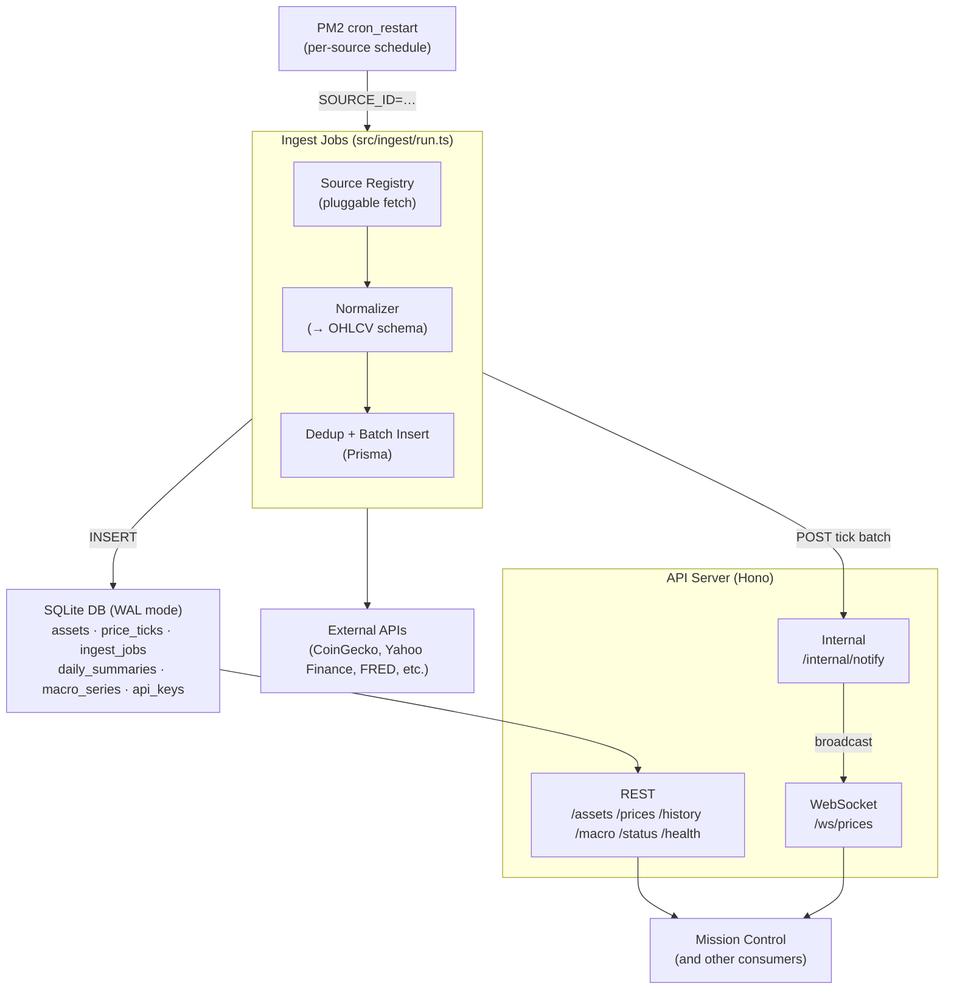
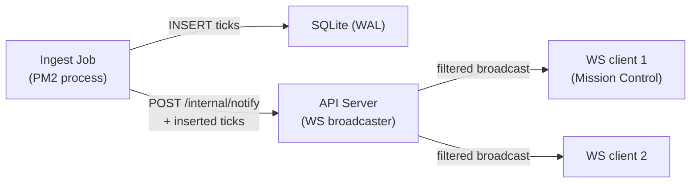

# Pulsar — Architecture Plan

## Overview

Pulsar is a dedicated financial data ingest and storage service within the `salsquared` ecosystem. It runs as a standalone backend (not a Next.js app) at **port 3103** (prod) / **4103** (dev), with its database reserved at **8103** (prod) / **8203** (dev).

Its job is to own all financial data: fetch it on a schedule from external APIs, normalize it into a consistent local schema, persist it, and expose it via a clean REST API. Mission Control and other internal consumers replace their direct external API calls with calls to Pulsar.

This separates concerns clearly:
- **Pulsar** — knows about data sources, ingestion timing, schema, and historical storage
- **Mission Control** — knows about UI, user sessions, and presentation

---

## Tech Stack

| Concern | Choice | Rationale |
|:---|:---|:---|
| Runtime | Node.js LTS (24.x) | Consistent with Mission Control |
| Language | TypeScript | Consistent with ecosystem |
| Framework | **Hono** | Fast, TypeScript-native, minimal overhead for a backend service |
| ORM | **Prisma** | Consistent with Mission Control; good migration tooling |
| Database | **SQLite** (file-based) | Consistent with ecosystem; ports 8103/8203 reserved for future PostgreSQL migration |
| Process Manager | **PM2** | Already used ecosystem-wide via `ecosystem.config.cjs`; `cron_restart` drives ingest scheduling |
| Package Manager | npm | Consistent with ecosystem |

### Why Hono over Next.js API routes

Pulsar has no UI and no SSR needs. Hono gives a simple `app.get('/route', handler)` interface with near-zero overhead and no build step, which is appropriate for a backend microservice.

---

## System Architecture



---

## Data Sources

### Crypto

| Source | Data | Tier | TTL |
|:---|:---|:---|:---|
| CoinGecko `/coins/markets` | Top-100 market data (price, cap, volume) | Free | 5 min |
| CoinGecko `/coins/{id}/market_chart` | Historical OHLCV per coin | Free | 1 hr |
| Mempool.space `/api/v1/fees/recommended` | Bitcoin network fees (fastest/hour/economy) | Free | 2 min |

### Equities & ETFs

| Source | Data | Tier | TTL |
|:---|:---|:---|:---|
| Yahoo Finance (yfinance-compatible) | OHLCV for stocks, ETFs, commodity proxies | Free | 15 min |
| Alpha Vantage (free key) | Supplemental stock quotes, fundamentals | Free (500 req/day) | 1 hr |

### Forex

| Source | Data | Tier | TTL |
|:---|:---|:---|:---|
| ExchangeRate-API `/latest/{base}` | Major pair rates (USD, EUR, GBP, JPY) | Free | 1 hr |

### Macro / Economic

| Source | Data | Tier | TTL |
|:---|:---|:---|:---|
| FRED API | CPI, GDP, Fed Funds Rate, unemployment | Free (API key) | 24 hr |

---

## Database Schema

```prisma
// Asset registry — one row per tradable symbol
model Asset {
  id          String       @id          // e.g. "bitcoin", "AAPL", "EUR/USD"
  symbol      String                    // e.g. "BTC", "AAPL", "EURUSD"
  name        String                    // e.g. "Bitcoin", "Apple Inc."
  assetClass  AssetClass               // CRYPTO | EQUITY | FOREX | COMMODITY | MACRO
  source      String                    // primary ingest source id
  active      Boolean      @default(true)
  priceTicks  PriceTick[]
  dailySums   DailySummary[]
}

// Raw price ticks — one row per price observation
model PriceTick {
  id        Int      @id @default(autoincrement())
  assetId   String
  asset     Asset    @relation(fields: [assetId], references: [id])
  timestamp DateTime
  open      Float?
  high      Float?
  low       Float?
  close     Float
  volume    Float?
  source    String   // which API this came from

  @@unique([assetId, timestamp, source])
  @@index([assetId, timestamp])
}

// Pre-aggregated daily summaries for fast charting queries
model DailySummary {
  id        Int      @id @default(autoincrement())
  assetId   String
  asset     Asset    @relation(fields: [assetId], references: [id])
  date      DateTime // normalized to midnight UTC
  open      Float
  high      Float
  low       Float
  close     Float
  volume    Float?

  @@unique([assetId, date])
  @@index([assetId, date])
}

// Macro indicator time series (FRED data, etc.)
model MacroSeries {
  id         Int      @id @default(autoincrement())
  seriesId   String                           // e.g. "FEDFUNDS", "CPIAUCSL"
  name       String
  value      Float
  timestamp  DateTime
  source     String

  @@unique([seriesId, timestamp])
  @@index([seriesId, timestamp])
}

// Ingest job log — tracks every scheduled run
model IngestJob {
  id          Int       @id @default(autoincrement())
  sourceId    String    // which source registry entry ran
  startedAt   DateTime
  completedAt DateTime?
  status      JobStatus // RUNNING | SUCCESS | PARTIAL | FAILED
  rowsInserted Int      @default(0)
  errorMsg    String?
}

enum AssetClass {
  CRYPTO
  EQUITY
  FOREX
  COMMODITY
  MACRO
}

enum JobStatus {
  RUNNING
  SUCCESS
  PARTIAL
  FAILED
}
```

---

## Source Registry

Mirrors Mission Control's company-registry pattern. Each source is a config object with a fetcher function and a cache TTL. **Scheduling is not in the registry** — it lives in `ecosystem.config.cjs` (PM2 `cron_restart`) so PM2 has a single source of truth for what runs when. The registry only knows how to fetch and normalize.

```typescript
// src/lib/source-registry.ts (sketch)
interface SourceConfig {
  id: string                // matches SOURCE_ID env var set by PM2
  label: string
  assetClass: AssetClass
  ttl: number               // cache TTL in seconds (for routes that read this source's data)
  fetch: () => Promise<NormalizedTick[]>
}

// NormalizedTick is the common output shape all fetchers must produce
interface NormalizedTick {
  assetId: string
  timestamp: Date
  close: number
  open?: number
  high?: number
  low?: number
  volume?: number
}
```

Adding a new data source requires two coordinated changes:
1. A new `SourceConfig` entry in `src/lib/source-registry.ts`
2. A new PM2 entry in `ecosystem.config.cjs` with `args: "tsx src/ingest/run.ts"`, `env.SOURCE_ID` matching the registry id, and the desired `cron_restart` schedule

---

## Ingest Pipeline

### Scheduled ingestion (proactive)

Scheduling is handled entirely by PM2 via `cron_restart` in `ecosystem.config.cjs`. Each source runs as a separate short-lived PM2 process: it starts, calls `runIngest(sourceId)`, and exits. PM2 restarts it on the cron schedule.

| Source | Schedule (`cron_restart`) |
|:---|:---|
| CoinGecko top-100 | `*/5 * * * *` |
| Mempool fees | `*/2 * * * *` |
| Yahoo Finance | `*/15 * * * *` |
| ExchangeRate-API | `0 * * * *` |
| FRED macro | `0 6 * * *` |

The entry point is `src/ingest/run.ts`. PM2 sets `SOURCE_ID` in the process env; the script reads it, calls `runIngest(sourceId)`, then exits. `autorestart` is `false` on all ingest entries so PM2 does not restart on normal exit — only the cron fires it.

Each run:
1. Calls the source's `fetch()` function
2. Normalizes ticks to the common schema
3. Deduplicates against existing rows (`@@unique` constraint on `[assetId, timestamp, source]`)
4. Batch-inserts via `createMany({ skipDuplicates: true })`
5. Logs an `IngestJob` row with status and row count

### On-demand historical backfill

When a consumer requests history beyond what's in the DB (e.g., `/history?id=bitcoin&from=2010-01-01`), Pulsar:
1. Checks the DB range for that asset
2. Detects gaps
3. Triggers a backfill fetch for the missing range from the appropriate source
4. Returns combined DB + fresh data

This is the same pattern used in Mission Control's `finance/history` route but generalized across all asset classes.

---

## Downsampling Worker

A nightly rollup aggregates `PriceTick` rows into `DailySummary` rows so chart queries hit pre-aggregated data instead of scanning raw ticks. It also enforces tick retention so SQLite size stays bounded as the tick table grows.

### Schedule

Runs as a dedicated PM2 entry at **00:30 UTC** — a 30-minute buffer past midnight gives late-arriving ticks time to land before the previous day is closed out.

```javascript
{
  name: "pulsar-rollup",
  cwd: "/Users/sal/salsquared/pulsar",
  script: "npx", args: "tsx src/ingest/rollup.ts",
  env: { NODE_ENV: "production" },
  cron_restart: "30 0 * * *", autorestart: false
}
```

### Algorithm (`src/ingest/rollup.ts`)

For each active `Asset`:
1. Find the most recent `DailySummary.date` for the asset (or fall back to the asset's earliest `PriceTick.timestamp` if no summaries exist yet)
2. For each day from that date to **yesterday** (UTC, inclusive):
   - Read all `PriceTick` rows where `assetId = X AND timestamp ∈ [day-start, day-end)`
   - Compute: `open` = first tick by timestamp, `close` = last tick by timestamp, `high` = MAX(close, high), `low` = MIN(close, low), `volume` = SUM(volume)
   - **Upsert** the `DailySummary` row using the `@@unique([assetId, date])` constraint

Upserting (rather than insert-only) makes the job idempotent: re-running it for the same day overwrites with current values, which is the right behaviour when late ticks arrive after the first rollup pass.

### Tick retention

After rollup finishes, delete `PriceTick` rows older than `TICK_RETENTION_DAYS` (env var, default `90`). `DailySummary` rows are kept indefinitely.

This bounds SQLite growth: at ~5 active sources averaging ~50 ticks/min combined, a 90-day window caps the tick table at roughly 32M rows — well within SQLite's comfortable range with proper indexing.

### Macro series

`MacroSeries` rows are not rolled up — the source data is already low-cadence (FRED publishes monthly/quarterly), so raw rows serve charts directly.

---

## REST API

Base URL: `http://localhost:3103/api` (prod) / `http://localhost:4103/api` (dev)

### Endpoints

| Method | Path | Description |
|:---|:---|:---|
| `GET` | `/assets` | List all active assets with metadata |
| `GET` | `/assets/:id` | Single asset detail |
| `GET` | `/prices/latest` | Latest tick for all active assets (or filtered by `?class=crypto`) |
| `GET` | `/prices/:id` | Latest tick for a single asset |
| `GET` | `/history/:id` | OHLCV history — params: `from`, `to`, `interval` (1h, 1d, 1w) |
| `GET` | `/history/:id/summary` | Pre-aggregated daily summary rows |
| `GET` | `/macro` | All latest macro series values |
| `GET` | `/macro/:seriesId` | History for a single macro series |
| `GET` | `/status` | Ingest job status, last run times, DB row counts |
| `GET` | `/status/jobs` | Recent `IngestJob` log entries |
| `GET` | `/health` | Liveness check — `200` if `SELECT 1` against the DB succeeds, `503` otherwise. Not cached. Used by Cloudflare Tunnel and any external uptime monitor |
| `POST` | `/ingest/:sourceId` | Manually trigger a single source ingest (internal — requires `PULSAR_INTERNAL_TOKEN`). Runs `runIngest` inline in the API process and responds with the inserted row count. Does *not* signal PM2 to restart the corresponding ingest job |

### Response shape

```typescript
// GET /prices/latest
{
  "timestamp": "2026-05-02T14:00:00Z",
  "data": [
    {
      "assetId": "bitcoin",
      "symbol": "BTC",
      "assetClass": "CRYPTO",
      "close": 95000,
      "change24h": 2.3,
      "volume": 28000000000,
      "source": "coingecko",
      "fetchedAt": "2026-05-02T13:55:00Z"
    }
  ]
}

// GET /history/bitcoin?from=2024-01-01&to=2025-01-01&interval=1d
{
  "assetId": "bitcoin",
  "interval": "1d",
  "points": [
    { "t": "2024-01-01T00:00:00Z", "o": 42000, "h": 43500, "l": 41000, "c": 43000, "v": 18000000000 }
  ]
}
```

### Caching

Adopt Mission Control's in-memory TTL cache pattern directly:
- Cache key: `pathname + sorted query params`
- On handler error: return stale response with `X-Cache: STALE-FALLBACK`
- Cache header: `X-Cache: HIT | MISS`
- TTL per route matches the underlying source TTL
- `/health`, `/status`, and `/internal/*` are **not** cached

### CORS

Mission Control calls Pulsar from its Next.js server, so server-to-server fetches don't trigger CORS. If a browser-side caller is ever added (e.g., direct WebSocket subscription from the dashboard), enable Hono's `cors()` middleware with an explicit allowlist of Mission Control origins — never `*`.

---

## WebSocket Push (Real-time Updates)

Mission Control's finance dashboard currently polls `/prices/latest`. WebSocket push removes polling lag and reduces redundant API requests once Pulsar is the data owner.

### Endpoint

`GET /ws/prices` upgrades to a WebSocket. Implemented via `@hono/node-ws`.

### Subscription protocol

After connecting, the client sends a JSON subscribe message:

```json
{ "type": "subscribe", "assetIds": ["bitcoin", "AAPL", "EUR/USD"] }
```

The server pushes `tick` messages whenever a subscribed asset has a new `PriceTick` inserted:

```json
{ "type": "tick", "assetId": "bitcoin", "tick": { "timestamp": "2026-05-02T14:00:00Z", "close": 95000, "source": "coingecko" } }
```

A subscribe message with no `assetIds` (or `assetIds: ["*"]`) subscribes to all updates. The client may send `{ "type": "unsubscribe", "assetIds": [...] }` at any time.

### Cross-process notification

Ingest jobs run in separate PM2 processes from the API server, so the API process needs out-of-band notification when new ticks land. The flow:



1. After a successful insert in `pipeline.ts:runIngest`, the job POSTs the inserted ticks to `http://localhost:{PORT}/internal/notify` with `Authorization: Bearer ${PULSAR_INTERNAL_TOKEN}`
2. The API server validates the token, then iterates connected WS clients and pushes the ticks each subscriber cares about
3. If the API server is down, the notification fails silently — the tick is still in the DB, so a reconnecting client can fetch the current state via REST. WebSocket delivery is **best-effort, not durable**.

### Backpressure & heartbeat

- Each WS client has a bounded outbound queue (default 256 messages). If the queue fills (slow consumer), the connection is closed with code `1009` and the client is expected to reconnect + resync via REST.
- The server sends a ping every 30 seconds; clients that miss two consecutive pings are disconnected.

---

## Authentication & Authorization

### Current state

Pulsar binds to `localhost:3103` and runs behind Cloudflare Tunnel. The network boundary is the security boundary — there is no per-request auth on public-facing endpoints.

### Internal endpoints

Two endpoints are sensitive even within the local network and are protected by a shared-secret env var:

| Endpoint | Purpose | Auth |
|:---|:---|:---|
| `POST /internal/notify` | Ingest job → API tick notification (drives WS push) | `Authorization: Bearer ${PULSAR_INTERNAL_TOKEN}` |
| `POST /ingest/:sourceId` | Manually trigger an ingest run | `Authorization: Bearer ${PULSAR_INTERNAL_TOKEN}` |

`PULSAR_INTERNAL_TOKEN` is a 32-byte random string generated at install time and stored in the untracked `.env`. Both the API process and every ingest job read it from the same env file (PM2 inherits the process env).

### Future: external API access

If Pulsar is ever exposed beyond Cloudflare Tunnel (e.g., to give Mission Control's browser direct WS access, or to share data with an external service), introduce API key middleware backed by a new model:

```prisma
model ApiKey {
  id          String   @id @default(cuid())
  keyHash     String   @unique           // bcrypt hash of the issued key
  name        String                      // human label, e.g. "mission-control-prod"
  scope       String                      // "read" | "admin"
  createdAt   DateTime @default(now())
  lastUsedAt  DateTime?
  active      Boolean  @default(true)
}
```

Middleware sketch:

```typescript
// src/lib/auth.ts
export async function requireApiKey(scope: 'read' | 'admin') {
  return async (c: Context, next: Next) => {
    const auth = c.req.header('Authorization')
    if (!auth?.startsWith('Bearer ')) return c.json({ error: 'unauthorized' }, 401)
    const match = await findActiveApiKey(auth.slice(7))   // bcrypt compare
    if (!match) return c.json({ error: 'unauthorized' }, 401)
    if (scope === 'admin' && match.scope !== 'admin') return c.json({ error: 'forbidden' }, 403)
    await prisma.apiKey.update({ where: { id: match.id }, data: { lastUsedAt: new Date() } })
    c.set('apiKey', match)
    await next()
  }
}
```

Per-key rate limiting (in-memory token bucket keyed by `apiKey.id`) layers on top of this when needed.

### Cloudflare Access (preferred when external auth is needed)

For service-to-service auth, Cloudflare Access service tokens work end-to-end with Cloudflare Tunnel and avoid us managing a key table at all. Prefer this over the `ApiKey` schema unless we need scoped, programmatic key issuance — defer building the table until that requirement is real.

---

## Integration with Mission Control

Once Pulsar is live, Mission Control's finance routes become thin proxies:

```typescript
// mission-control: app/api/finance/route.ts (after migration)
const res = await fetch('http://localhost:3103/api/prices/latest?class=crypto')
return NextResponse.json(await res.json())
```

Migration path:
1. Stand up Pulsar with CoinGecko + Mempool sources
2. Verify Pulsar `/prices/latest` output matches Mission Control's current finance route shape
3. Swap Mission Control's direct CoinGecko calls to Pulsar calls
4. Decommission the duplicated ingest logic in Mission Control

---

## PM2 Integration

Add to `/Users/sal/salsquared/ecosystem.config.cjs`:

```javascript
// API server — prod
{
  name: "pulsar",
  cwd: "/Users/sal/salsquared/pulsar",
  script: "npm",
  args: "run start",
  env: { PORT: 3103, NODE_ENV: "production" }
},
// API server — dev
{
  name: "pulsar-dev",
  cwd: "/Users/sal/salsquared/pulsar",
  script: "npm",
  args: "run dev",
  env: { PORT: 4103, NODE_ENV: "development" }
},

// Ingest jobs — one entry per source, scheduled via cron_restart
// autorestart: false so PM2 doesn't restart on normal (zero-exit) completion
{
  name: "pulsar-ingest-coingecko",
  cwd: "/Users/sal/salsquared/pulsar",
  script: "npx", args: "tsx src/ingest/run.ts",
  env: { SOURCE_ID: "coingecko", NODE_ENV: "production" },
  cron_restart: "*/5 * * * *", autorestart: false
},
{
  name: "pulsar-ingest-mempool",
  cwd: "/Users/sal/salsquared/pulsar",
  script: "npx", args: "tsx src/ingest/run.ts",
  env: { SOURCE_ID: "mempool", NODE_ENV: "production" },
  cron_restart: "*/2 * * * *", autorestart: false
},
{
  name: "pulsar-ingest-yahoo",
  cwd: "/Users/sal/salsquared/pulsar",
  script: "npx", args: "tsx src/ingest/run.ts",
  env: { SOURCE_ID: "yahoo", NODE_ENV: "production" },
  cron_restart: "*/15 * * * *", autorestart: false
},
{
  name: "pulsar-ingest-exchangerate",
  cwd: "/Users/sal/salsquared/pulsar",
  script: "npx", args: "tsx src/ingest/run.ts",
  env: { SOURCE_ID: "exchangerate", NODE_ENV: "production" },
  cron_restart: "0 * * * *", autorestart: false
},
{
  name: "pulsar-ingest-fred",
  cwd: "/Users/sal/salsquared/pulsar",
  script: "npx", args: "tsx src/ingest/run.ts",
  env: { SOURCE_ID: "fred", NODE_ENV: "production" },
  cron_restart: "0 6 * * *", autorestart: false
},

// Nightly downsampling worker — rolls PriceTick → DailySummary, prunes old ticks
{
  name: "pulsar-rollup",
  cwd: "/Users/sal/salsquared/pulsar",
  script: "npx", args: "tsx src/ingest/rollup.ts",
  env: { NODE_ENV: "production" },
  cron_restart: "30 0 * * *", autorestart: false
}
```

---

## Operational Constraints & Edge Cases

These are the load-bearing constraints that fall out of the multi-process PM2 design. Code should respect them; reviewers should flag violations.

### SQLite write concurrency — WAL mode is mandatory

The PM2 design has 5+ ingest processes, the API server, and the nightly rollup all opening connections to the same SQLite file. SQLite's default rollback-journal mode allows only one writer at a time — concurrent ingests would fail with `SQLITE_BUSY`.

`src/lib/prisma.ts` runs the following on every PrismaClient instantiation:

```sql
PRAGMA journal_mode = WAL;
PRAGMA busy_timeout = 5000;
PRAGMA synchronous = NORMAL;
```

WAL allows concurrent readers alongside a single writer, with writers serialized through the WAL — sufficient for the expected concurrency. `busy_timeout = 5000` makes writers wait up to 5s for the lock instead of erroring immediately. `synchronous = NORMAL` is safe with WAL and noticeably faster than `FULL`.

### Process startup burst

`pm2 start ecosystem.config.cjs` launches every entry immediately. With 5+ ingest jobs, that's 5+ simultaneous fetches on boot — risking outbound rate-limit hits and a brief SQLite write contention spike before the cron schedules diverge.

Mitigation: `src/ingest/run.ts` honours an optional `STARTUP_DELAY_SECONDS` env var. Stagger initial runs by setting different values per ingest entry (`0`, `15`, `30`, `45`, `60`). Cron-driven subsequent runs are unaffected.

### Long-running ingests vs. `cron_restart`

`cron_restart` fires at the cron time **regardless of whether the previous run is still alive** — PM2 sends `SIGKILL` and restarts. Fine for the standard fetch-insert-exit pattern (seconds), destructive for long backfills.

Rule: **scheduled ingest jobs perform incremental fetches only.** Backfills run through the on-demand path in `/history/:id` or via `POST /ingest/:sourceId`, both of which execute in the API process — never in the cron-driven jobs. Manual backfills that need to span many years should use a one-off script in `scripts/` invoked via `npx tsx`, outside PM2.

### Time zones

Every timestamp persisted to SQLite is UTC. Source fetchers must convert any local-time data (Yahoo Finance returns market-local times for some assets) to UTC before producing `NormalizedTick`. `DailySummary.date` is normalized to **midnight UTC** of the day being summarized.

### Outbound rate limiting & retries

Each source fetcher is responsible for its own rate-limit handling:
- Exponential backoff with jitter on `429` and `503`
- Per-source max retry count (default 3)
- On final failure, the `IngestJob` row is written with `status = FAILED` and `errorMsg` populated; the next scheduled run still attempts a fresh fetch (no carry-over backoff state across processes)
- Where free-tier APIs publish rate limits, fetchers respect them via static delays between requests in a batch (e.g., CoinGecko's 10–30 req/min)

### Logging across processes

Every PM2 process has its own log stream. `src/lib/logger.ts` includes a `proc` field on every line — `"api"`, `"rollup"`, or the `SOURCE_ID` of the ingest job — so `pm2 logs` aggregates trace-ably. Cross-process queryable events (start, end, row count, error message) also land in `IngestJob` so an operator can ask the DB instead of grepping logs.

### Prisma migrations

Migrations are **never** run by PM2 entries. Deploy flow:

1. Pull latest code
2. `npx prisma migrate deploy`
3. `pm2 reload "pulsar*"` to pick up the new client + code

Putting `prisma migrate` on a process startup path would race when multiple PM2 processes boot concurrently. Migrations are a deploy step, not a runtime step.

### Manual trigger semantics

`POST /ingest/:sourceId` runs `runIngest` **inline** in the API process (synchronous response with row count). Trade-off: a slow source ingest blocks one API request handler. Acceptable because this endpoint is operator-only and rate-limited by who knows the internal token. If a future use case needs async triggers, return `202 Accepted` and spawn a detached child running `tsx src/ingest/run.ts`.

---

## File Structure

```
pulsar/
├── src/
│   ├── index.ts              # Hono app entry point, mounts routes + WS
│   ├── routes/
│   │   ├── assets.ts
│   │   ├── prices.ts
│   │   ├── history.ts        # also triggers backfill via pipeline.ts
│   │   ├── macro.ts
│   │   ├── status.ts         # /status, /status/jobs, /health
│   │   ├── ws.ts             # /ws/prices — subscribe/broadcast
│   │   ├── internal.ts       # /internal/notify (token-protected)
│   │   └── ingest.ts         # POST /ingest/:sourceId (token-protected)
│   ├── ingest/
│   │   ├── run.ts            # PM2 entry: reads SOURCE_ID, optional STARTUP_DELAY_SECONDS, runs once, exits
│   │   ├── pipeline.ts       # fetch → normalize → dedup → insert; also exposes backfill()
│   │   ├── rollup.ts         # nightly DailySummary aggregation + tick retention pruning
│   │   └── sources/
│   │       ├── coingecko.ts
│   │       ├── mempool.ts
│   │       ├── yahoo.ts
│   │       ├── fred.ts
│   │       └── exchangerate.ts
│   ├── lib/
│   │   ├── cache.ts          # in-memory TTL cache (port from Mission Control)
│   │   ├── prisma.ts         # PrismaClient singleton + WAL/busy_timeout PRAGMAs
│   │   ├── logger.ts         # structured logging with `proc` field
│   │   ├── source-registry.ts # SourceConfig entries (no schedules — those live in ecosystem.config.cjs)
│   │   ├── notify.ts         # POST helper used by ingest jobs to call /internal/notify
│   │   └── auth.ts           # internal-token + (future) ApiKey middleware
│   └── types.ts              # NormalizedTick, SourceConfig, WS message types, etc.
├── prisma/
│   └── schema.prisma
├── scripts/                  # one-off scripts (backfills, DB inspection) run via `npx tsx`
├── docs/
│   └── architecture.md       # this file
├── .env                      # API keys + PULSAR_INTERNAL_TOKEN (untracked)
├── .env.development          # DATABASE_URL only (committed)
├── .env.production           # DATABASE_URL only (committed)
├── package.json
└── tsconfig.json
```

---

## Open Questions / Future Considerations

- **PostgreSQL migration:** Ports 8103/8203 are reserved. TimescaleDB (PostgreSQL extension) is well-suited for the `price_ticks` table once volume outgrows SQLite's comfortable working set. The migration is mostly a Prisma datasource change plus a one-time data copy; the schema is portable as-is.
- **Alerting:** Hook into `IngestJob.status = FAILED` rows (or repeated failures across N runs) to push a notification — e.g., into Mission Control's internal systems dash, or via webhook to Discord/Slack. Today the only signal is `pm2 logs` and the IngestJob table.
- **Observability:** Add a Prometheus `/metrics` endpoint (job duration histograms, rows-inserted counters, cache hit rate, WS client count). Cheap to add once the service is running.
- **Shared TypeScript client SDK:** Publish a small `@salsquared/pulsar-client` package (or a workspace-internal one) so Mission Control gets typed responses without redefining `NormalizedTick` / response shapes locally. Defer until the API surface stabilizes.
- **Backups:** Periodic `sqlite3 .backup` of `prod.db` to an off-host location. Easy to add once the data is load-bearing for Mission Control.
